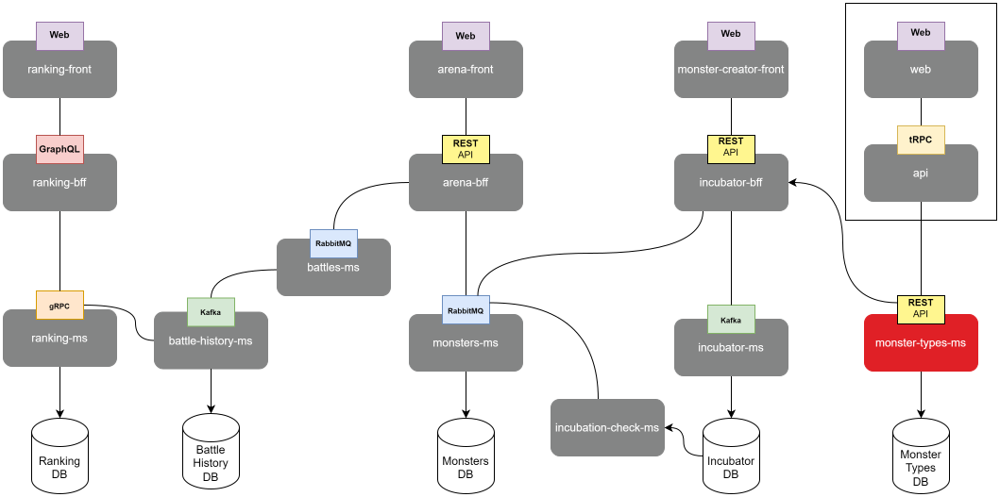

# Portfolio Monster Types Microservice



This is the microservice responsible for handling monster-type-related data in the application.

## Installation

1. Clone this repository to your local machine:

```
git clone https://github.com/crisgarlez/portfolio-monster-types-ms.git
```

2. Install project dependencies:

```
cd portfolio-monsters-ms
npm install
```

## Configuration

Before running the microservice, you need to configure some environment variables. Create a .env file at the root of the project and set the following variables:

```
PORT=3009
DATABASE_URL=
POSTGRES_DB=
POSTGRES_PORT="5432"
POSTGRES_PASSWORD=
POSTGRES_USER=
POSTGRES_HOST=
```

## Usage

To run the microservice, simply execute the following command:

```
npm start
```
